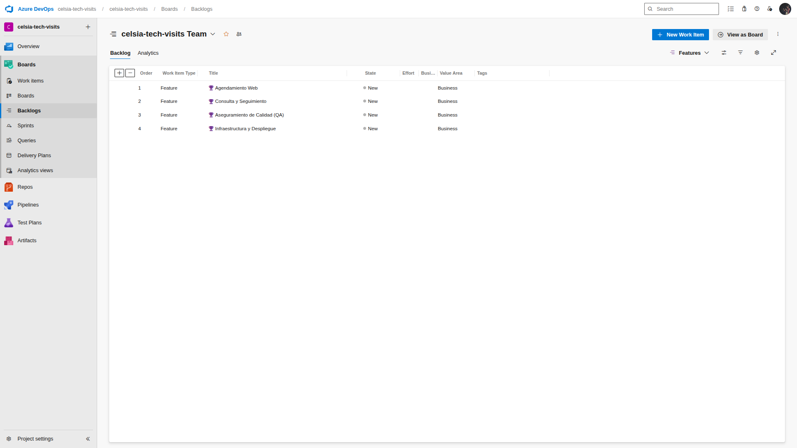

# Product Backlog — Celsia Tech Visits

> Este es el link del tablero de Azure DevOps: https://dev.azure.com/celsia-tech-visits/celsia-tech-visits

En dado caso de necesitar acceso al tablero, favor solicitarlo al correo [jumarana1007@gmail.com], indicando el correo electrónico con el que se desea acceder.

---

## 📂 Épica 1: Autogestión de Visitas Técnicas
**Objetivo**: Permitir a los clientes residenciales gestionar sus visitas técnicas de forma autónoma a través de canales digitales, reduciendo la dependencia del call center.

### 🧩 Feature 1.1: Agendamiento Web
Funcionalidad que permite a los usuarios reservar una cita técnica seleccionando fecha y hora.

#### 📝 US-01: Programar Visita Técnica (Frontend)
**Como** cliente residencial,
**quiero** programar mi visita técnica desde la página web mediante un formulario intuitivo,
**para** asegurar que la atención se realice en el día y horario que más me convenga.

**Criterios de Aceptación:**
- **Validación de Datos:** NIC numérico (mín. 4 dígitos), Nombre requerido.
- **Reglas de Negocio:** No permitir fechas pasadas ni fines de semana (Sáb/Dom).
- **UX/UI:** Feedback visual inmediato (éxito/error) y uso del Design System de Celsia.
- **Duplicidad:** Implementar validación para evitar doble agendamiento en el mismo slot.

### 🧩 Feature 1.2: Consulta y Seguimiento
Funcionalidad para que los usuarios verifiquen el estado de sus solicitudes previas.

#### 📝 US-02: Consultar Mis Visitas (Frontend)
**Como** cliente,
**quiero** consultar el estado de mis visitas programadas ingresando mi NIC,
**para** verificar la fecha y hora sin tener que llamar al contact center.

**Criterios de Aceptación:**
- **Búsqueda:** Pestaña "My Visits" con input de búsqueda por NIC.
- **Visualización:** Tarjetas con fechas formateadas, hora (AM/PM) y estado visual (badges de color).
- **Manejo de Errores:** Mensajes claros cuando no se encuentran registros o hay error de conexión.

#### 📝 US-03: API de Gestión por NIC (Backend)
**Como** sistema frontend,
**quiero** un endpoint que permita obtener las citas filtradas por el NIC del cliente,
**para** mostrar únicamente la información relevante al usuario autenticado.

**Criterios de Aceptación:**
- **Endpoint:** `GET /api/appointments/nic/{nic}`.
- **Respuesta:** Lista de objetos JSON ordenados descendente por fecha.
- **Performance:** Tiempo de respuesta óptimo (<200ms) indexando por columna NIC.

---

## 📂 Épica 2: Excelencia Técnica y DevOps
**Objetivo**: Garantizar la calidad, mantenibilidad y despliegue continuo de la solución mediante prácticas modernas de ingeniería de software.

### 🧩 Feature 2.1: Aseguramiento de Calidad (QA)
Implementación de herramientas y procesos para mantener altos estándares de código.

#### 📝 US-04: Estrategia de Pruebas y Análisis Estático
**Como** líder técnico,
**quiero** asegurar la calidad del código mediante análisis estático y pruebas unitarias,
**para** reducir la deuda técnica y prevenir bugs en producción.

**Criterios de Aceptación:**
- **Unit Testing:** Cobertura >80% en controladores usando xUnit y Moq/InMemory.
- **SonarQube:** Análisis integrado en el pipeline sin "Code Smells" críticos.
- **Reportes:** Generación automática de reportes de cobertura (`coverage.xml`).

### 🧩 Feature 2.2: Infraestructura y Despliegue
Automatización del ciclo de vida de la aplicación.

#### 📝 US-05: Contenerización y CI/CD
**Como** ingeniero DevOps,
**quiero** empaquetar la solución en contenedores y desplegarla automáticamente,
**para** garantizar la consistencia entre entornos.

**Criterios de Aceptación:**
- **Docker:** Imágenes optimizadas (Multi-stage build) para Backend (.NET 8) y Frontend (Nginx).
- **Orquestación:** Archivo `docker-compose.yml` funcional para despliegue local.
- **Pipelines:** Definición en Azure DevOps (`backend-ci.yml`, `cd-azure-appservice.yml`) para Build, Test y Deploy automático.

**Capturas Tablero Azure DevOps**

